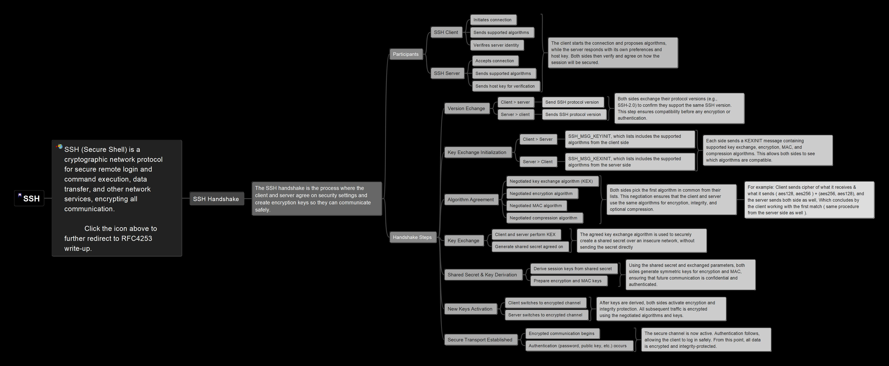

# SSH Security Assessment Tool

A comprehensive SSH server security scanner that detects weak cryptographic algorithms and tests for downgrade attack vulnerabilities.

## Features

- **Banner Grabbing**: Raw socket SSH banner extraction
- **Algorithm Enumeration**: Complete SSH algorithm discovery (KEX, Ciphers, MACs, Host Keys)
- **Security Assessment**: Automatic vulnerability classification with CVE references
- **Intelligent Downgrade Testing**: Attempts targeted attacks based on discovered weaknesses
- **Detailed Reporting**: JSON output with actionable recommendations





## Installation
```bash
git clone 
cd SSHPostureAnalyzer
pip install -r requirements.txt
```

## Usage

### Quick Scan
```bash
python main.py -i 192.168.1.100 --auto
```

### Enumeration Only
```bash
python main.py -i target.com -e -o results.json
```

### Full Assessment with Downgrade Testing
```bash
python main.py -i 10.0.0.1 -e -d -u root -o full_report.json
```


## Output Example
```json
{
  "scan_time": "2025-01-01 12:00:00",
  "target": {"ip": "192.168.1.100", "port": 22},
  "enumeration": {
    "security_assessment": {
      "overall_risk": "HIGH",
      "weak_algorithms_count": 5,
      "downgrade_possible": true,
      "recommendations": [
        "Disable weak KEX algorithms: diffie-hellman-group1-sha1",
        "Disable weak ciphers: aes128-cbc, 3des-cbc"
      ]
    }
  },
  "downgrade_attacks": {
    "attacks_attempted": 1,
    "successful_attacks": 1,
    "attack_details": [...]
  }
}
```

## How It Works

1. **Enumeration Phase**:
   - Connects to SSH server
   - Extracts banner information
   - Lists all supported algorithms
   - Classifies each algorithm (secure/weak/vulnerable)
   - Calculates overall risk score

2. **Downgrade Attack Phase**:
   - Uses enumeration findings to select weak algorithms
   - Attempts SSH connection forcing weak algorithms
   - Analyzes connection results:
     - Success = Server accepts weak algorithms (VULNERABLE)
     - "No matching algorithm" = Server rejects (SECURE)
     - Auth failure = Algorithms accepted but needs credentials (VULNERABLE)

3. **Reporting**:
   - Detailed JSON with all findings
   - CVE references for known vulnerabilities
   - Specific remediation recommendations


## Security Disclaimer

This tool is for **authorized security testing only**. Ensure you have permission before scanning any systems you don't own.


## License

Educational/Research Use

